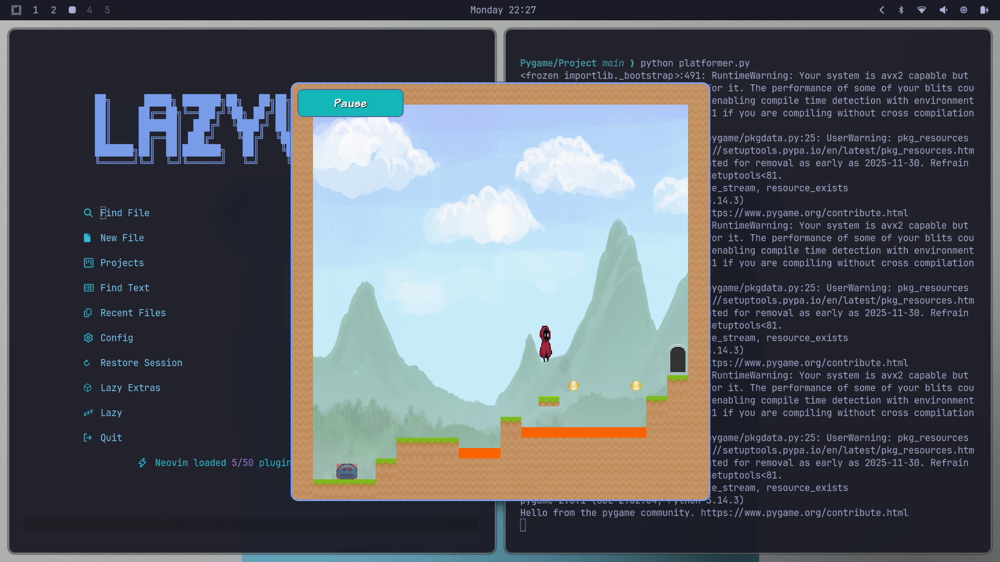
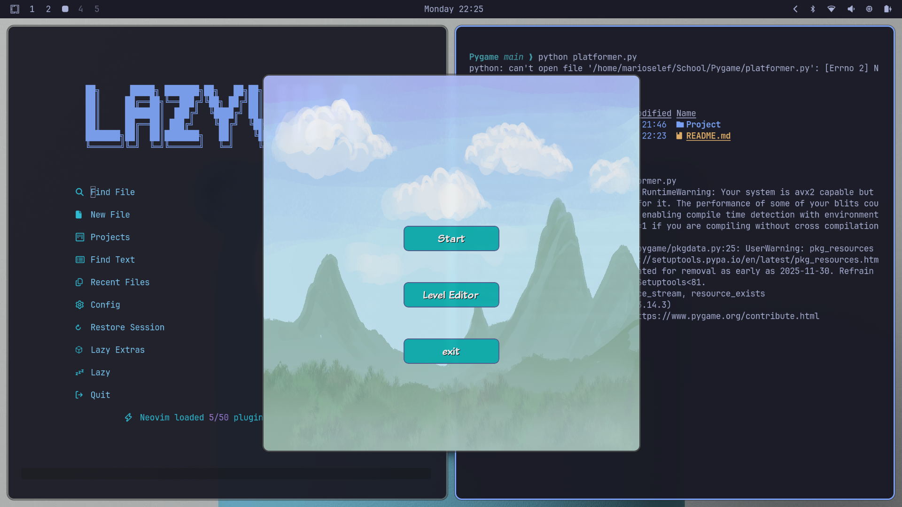
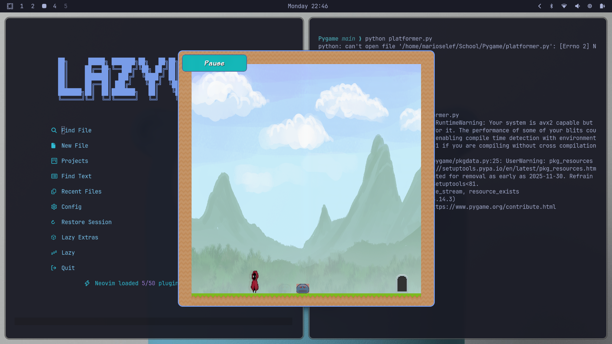
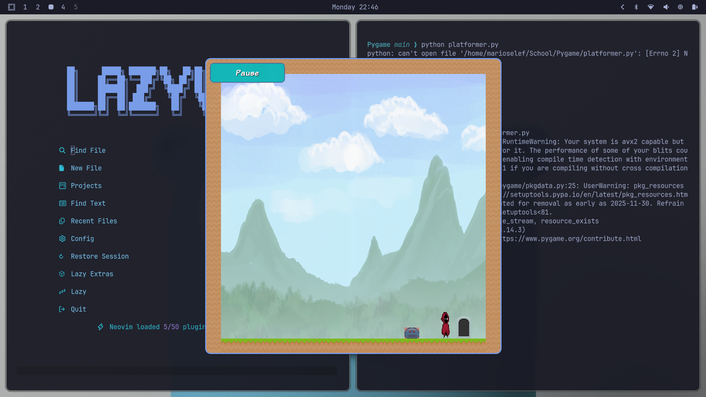
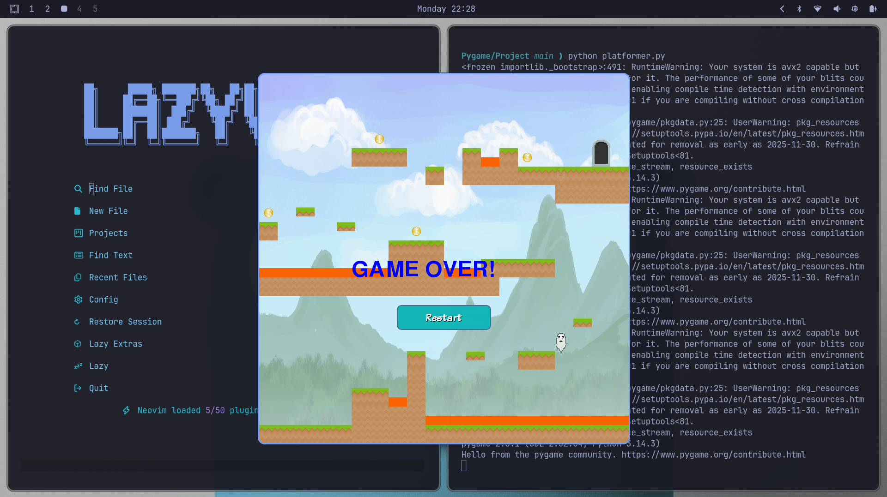
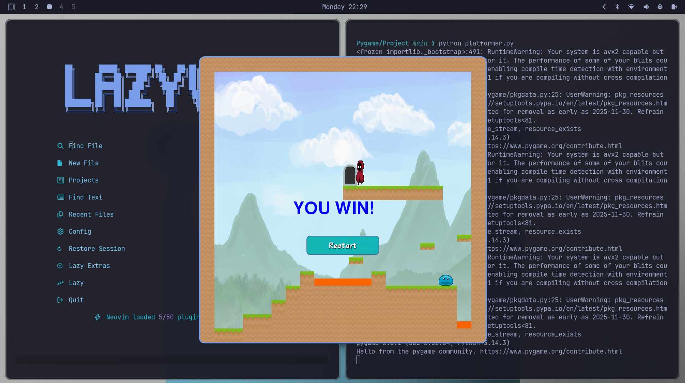
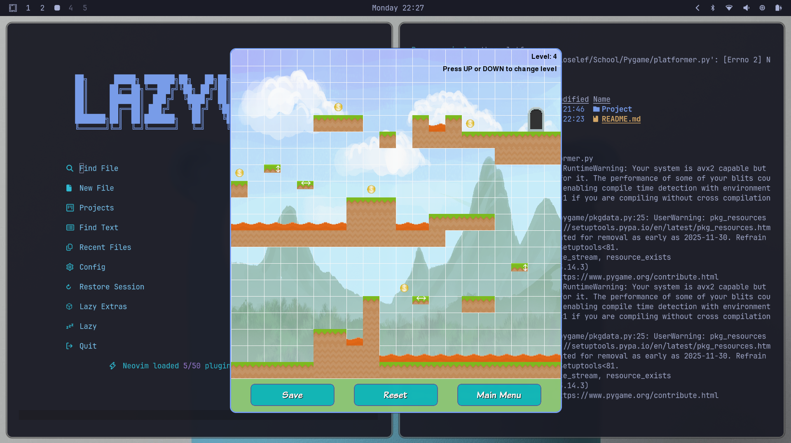

# Platformer with AI Enemies

A 2D side-scrolling platformer built with **Python** and **Pygame**. Navigate through 5 handcrafted levels, dodge AI-driven enemies, collect coins, and reach the exit door.



---

## Table of Contents

1. [Features](#features)
2. [Controls](#controls)
3. [Physics System](#physics-system)
   - [Gravity](#gravity)
   - [Jumping](#jumping)
   - [Tile Collision](#tile-collision)
4. [Moving Platforms](#moving-platforms)
   - [Platform Movement Formula](#platform-movement-formula)
   - [Player–Platform Interaction](#playerplatform-interaction)
5. [AI Enemy System](#ai-enemy-system)
   - [Euclidean Distance Formula](#euclidean-distance-formula)
   - [Blob Enemy (Green)](#blob-enemy-green)
   - [AI Chaser Enemy (Red)](#ai-chaser-enemy-red)
   - [Enemy Gravity and Collision](#enemy-gravity-and-collision)
6. [Game Objects](#game-objects)
7. [Screens and Menus](#screens-and-menus)
8. [Level Editor](#level-editor)
9. [Project Structure](#project-structure)
10. [Requirements and Running the Game](#requirements-and-running-the-game)

---

## Features

- **5 levels** with increasing difficulty
- **Two AI enemy types** with distinct detection ranges and speeds
- **Moving platforms** — horizontal and vertical
- **Lava hazards**, **collectible coins**, and an **exit door** per level
- **Pause menu** with resume, restart, and main menu options
- **Built-in level editor** to create and save custom levels
- **Sound effects** — background music, jumping, coin collection, and game over

---

## Controls

| Key | Action |
|-----|--------|
| Arrow Left | Move left |
| Arrow Right | Move right |
| Arrow Up | Jump |
| Mouse click | Interact with all buttons |

---

## Physics System

All physics calculations run every frame at **60 FPS** (frames per second), controlled by `pygame.time.Clock`.

### Gravity

Gravity is simulated by incrementing the player's (and enemies') vertical velocity (`vel_y`) by **+1 per frame**. This mimics constant downward acceleration.

```
vel_y = vel_y + 1          (each frame)
```

To prevent infinite acceleration (terminal velocity), `vel_y` is capped at **10 pixels/frame**:

```
if vel_y > 10:
    vel_y = 10
```

Each frame, the vertical displacement is:

```
dy = vel_y
```

The player's vertical position is then updated:

```
new_y = player.rect.y + dy
```

### Jumping

When the player presses **Arrow Up**, and they are **not already in the air** and **have not already jumped**, the vertical velocity is set to a large negative value (upward):

```
vel_y = -15      (pixels/frame, upward)
```

Gravity then decelerates the jump each frame until `vel_y` becomes positive again and the player falls back down. The `jumped` flag prevents holding the key from triggering multiple jumps. `in_air` is set to `True` at the start of each frame and only reset to `False` when a ground collision is detected below the player.

### Tile Collision

Collision detection runs **separately for the X and Y axes** each frame to avoid corner-trapping bugs. The player's hitbox is **30×80 pixels** (narrower than the sprite image to give fair collision margins).

**X-axis (horizontal) collision:**

```
for each tile:
    if tile overlaps (player.x + dx, player.y, width, height):
        dx = 0      ← stop horizontal movement
```

**Y-axis (vertical) collision:**

```
for each tile:
    if tile overlaps (player.x, player.y + dy, width, height):
        if vel_y < 0:                          ← player moving upward (hitting ceiling)
            dy = tile.bottom - player.rect.top
            vel_y = 0
        if vel_y >= 0:                         ← player moving downward (landing)
            dy = tile.top - player.rect.bottom
            vel_y = 0
            in_air = False
```

When `in_air` is set to `False`, the player is confirmed to be standing on ground, which re-enables jumping.

---

## Moving Platforms

There are two types of moving platforms, defined by tile values in the level data:

| Tile Value | Platform Type |
|------------|--------------|
| 4 | Horizontal (moves left–right) |
| 5 | Vertical (moves up–down) |

### Platform Movement Formula

Each `Platform` object stores:
- `move_x` — horizontal movement flag (1 = moves horizontally, 0 = does not)
- `move_y` — vertical movement flag (1 = moves vertically, 0 = does not)
- `move_direction` — current direction: `+1` or `−1`
- `move_counter` — tracks total distance travelled in current direction

Every frame, the platform position is updated by:

```
platform.rect.x += move_direction × move_x
platform.rect.y += move_direction × move_y
move_counter += 1
```

When `|move_counter| > 50` (50 pixels of travel), the platform reverses direction:

```
move_direction = move_direction × −1
move_counter   = move_counter   × −1
```

This creates a back-and-forth oscillating motion within a **50-pixel range** on either side of the starting position (total travel = 100 pixels).

### Player–Platform Interaction

Platform collision is handled **after** tile collision, with a special **closeness threshold** (`col_thresh = 20 pixels`) to correctly determine which face of the platform the player is touching:

**X-axis:**
```
if platform overlaps (player.x + dx, player.y, width, height):
    dx = 0
```

**Y-axis — hitting the underside of a platform:**
```
if |( player.rect.top + dy ) − platform.rect.bottom| < col_thresh:
    vel_y = 0
    dy = platform.rect.bottom − player.rect.top
```

**Y-axis — landing on top of a platform:**
```
if |( player.rect.bottom + dy ) − platform.rect.top| < col_thresh:
    player.rect.bottom = platform.rect.top − 1
    in_air = False
    dy = 0
```

**Carrying the player horizontally (horizontal platforms only):**

When the player is standing on a horizontally moving platform (`move_x != 0`), the player is shifted by the same amount as the platform each frame:

```
if platform.move_x != 0:
    player.rect.x += platform.move_direction
```

This makes the player "ride" the platform without any extra velocity calculation.

---

## AI Enemy System

Both enemy types use the **Euclidean distance formula** to measure how far away the player is. Based on this distance, they switch between **patrol mode** and **chase mode**.

### Euclidean Distance Formula

```
dist = √( (enemy_x − player_x)² + (enemy_y − player_y)² )
```

In Python (using `math.sqrt`):

```python
dist = math.sqrt(
    (self.rect.centerx - player.rect.centerx) ** 2 +
    (self.rect.centery - player.rect.centery) ** 2
)
```

This gives the straight-line distance in pixels between the centre of the enemy and the centre of the player. It accounts for both horizontal and vertical separation, making the detection circular rather than just a horizontal check.

---

### Blob Enemy (Green)

**Tile value:** `3`

| Parameter | Value |
|-----------|-------|
| Patrol speed | 2 px/frame |
| Chase speed | 3 px/frame |
| Detection range | 150 px |
| Patrol distance | 50 px each way |

**Behaviour logic (every frame):**

```
dist = √( (enemy_x − player_x)² + (enemy_y − player_y)² )

if dist < 150:                   ← player is within detection range
    chase player horizontally
        if player is to the left:   dx = −3
        if player is to the right:  dx = +3
else:                            ← player is out of range → patrol
    dx = move_direction × 2
    move_counter += 2
    if |move_counter| > 50:
        move_direction = −move_direction
        move_counter = 0
```

---

### AI Chaser Enemy (Red)

**Tile value:** `9` — visually distinguished by a red tint overlay

| Parameter | Value |
|-----------|-------|
| Patrol speed | 1 px/frame |
| Chase speed | 2 px/frame |
| Detection range | 200 px |
| Patrol distance | 50 px each way |

**Behaviour logic (every frame):**

```
dist = √( (enemy_x − player_x)² + (enemy_y − player_y)² )

if dist < 200:                   ← larger detection range than Blob
    chase player horizontally
        if player is to the left:   dx = −2
        if player is to the right:  dx = +2
else:                            ← patrol
    dx = move_direction × 1
    move_counter += 1
    if |move_counter| > 50:
        move_direction = −move_direction
        move_counter = 0
```

The AI Chaser has a **wider detection range (200 px vs 150 px)** but a **slower chase speed (2 vs 3)**, making it persistent but not overwhelming. The patrol is also slower (1 vs 2), making it easier to avoid until it locks onto you.

### Enemy Gravity and Collision

Both enemy types have their own gravity and tile collision, using the **same gravity model as the player**:

```
vel_y = vel_y + 1       (each frame)
if vel_y > 10:
    vel_y = 10
dy = vel_y
```

**Tile collision (Y-axis):**
```
if vel_y >= 0 (falling):
    dy = tile.top − enemy.rect.bottom    ← land on top of tile
    vel_y = 0
if vel_y < 0 (rising):
    dy = tile.bottom − enemy.rect.top    ← hit ceiling
    vel_y = 0
```

This means enemies stay grounded on terrain, fall off edges, and cannot fly or walk through walls.

---

## Game Objects

| Object | Tile Value | Description |
|--------|-----------|-------------|
| Empty | 0 | No tile |
| Dirt | 1 | Solid ground tile (brown) |
| Grass | 2 | Solid ground tile (green) |
| Blob enemy | 3 | Green AI patrol/chase enemy |
| Horizontal platform | 4 | Moves left–right |
| Vertical platform | 5 | Moves up–down |
| Lava | 6 | Instant death on contact |
| Coin | 7 | Collectible, adds to score |
| Exit door | 8 | Completes the level when touched |
| AI Chaser enemy | 9 | Red AI patrol/chase enemy |

---

## Screens and Menus

### Main Menu



- **Start** — begin the game from level 1
- **Level Editor** — open the level editor tool
- **Exit** — quit the game

### In-Game HUD


- Coin counter displayed top-left (format: `X <count>`)
- **Pause** button in the top-left corner during active gameplay

### AI Enemies in Action





### Pause Menu
- **Resume** — continue playing
- **Restart** — restart the current level and reset score
- **Main Menu** — return to the main menu

### Game Over Screen



- Player sprite replaced with a ghost image
- Ghost floats upward
- **GAME OVER!** text displayed
- **Restart** button reloads the current level

### Level Complete / You Win



- Automatically advances to the next level on exit touch
- After level 5: displays **YOU WIN!** with a restart option to play again from level 1

---

## Level Editor



Launch from the main menu or directly:

```bash
python levels/level_editor.py
```

### Editor Controls

| Input | Action |
|-------|--------|
| Left click on a cell | Cycle tile type forward (0 → 9 → 0) |
| Right click on a cell | Cycle tile type backward (0 → 9 → 0) |
| Arrow Up | Switch to next level |
| Arrow Down | Switch to previous level |
| Save button | Save current level to disk (binary file) |
| Reset button | Reload the last saved state for the current level |
| Main Menu button | Return to the main game |

### How Level Data is Stored

Level data is a **20×20 grid** of integers, stored as a binary file using Python's `pickle` module:

```python
# Saving
pickle.dump(world_data, open('level1_data', 'wb'))

# Loading
world_data = pickle.load(open('level1_data', 'rb'))
```

Each cell in the grid holds a tile value (0–9). When the game loads a level, it iterates through this grid row by row, column by column, and places the corresponding sprite or object at `(col × tile_size, row × tile_size)` pixels.

---

## Project Structure

```
Project/
├── platformer.py              # Main game — all game logic, physics, AI, rendering
├── levels/
│   ├── level_editor.py        # Level editor tool
│   ├── level1_data            # Level 1 (binary pickle file)
│   ├── level2_data            # Level 2
│   ├── level3_data            # Level 3
│   ├── level4_data            # Level 4
│   └── level5_data            # Level 5
└── img/
    ├── background0.png        # Background image
    ├── guy1.png – guy4.png    # Player animation frames
    ├── ghost.png              # Player death sprite
    ├── blob.png               # Enemy sprite (used for both enemy types)
    ├── dirt.png               # Dirt tile
    ├── grass.png              # Grass tile
    ├── platform.png           # Generic platform sprite
    ├── platform_x.png         # Horizontal platform (editor preview)
    ├── platform_y.png         # Vertical platform (editor preview)
    ├── lava.png               # Lava hazard
    ├── coin.png               # Collectible coin
    ├── exit.png               # Exit door
    ├── musiccc.wav            # Background music
    ├── coin.wav               # Coin pickup sound
    ├── jump.wav               # Jump sound
    ├── game_over.wav          # Game over sound
    └── button_*.png           # UI button images
```

---

## Requirements and Running the Game

**Requirements:**
- Python 3.x
- Pygame

**Install Pygame:**

```bash
pip install pygame
```

**Run the game:**

```bash
cd Project
python platformer.py
```

**Run the level editor directly:**

```bash
cd Project
python levels/level_editor.py
```

---

## Summary of Key Technical Concepts

| Concept | Formula / Method |
|---------|-----------------|
| Gravity acceleration | `vel_y += 1` per frame, capped at 10 |
| Jump initiation | `vel_y = -15` |
| Horizontal movement | `dx = ±5` (player), `±2–3` (enemies) |
| Euclidean detection | `dist = √((ex−px)² + (ey−py)²)` |
| Platform oscillation | Reverses at `\|move_counter\| > 50` |
| Player carried by platform | `player.rect.x += platform.move_direction` |
| Collision resolution | Separate X and Y axis checks per frame |
| Level storage | Python `pickle` — 20×20 integer grid |
